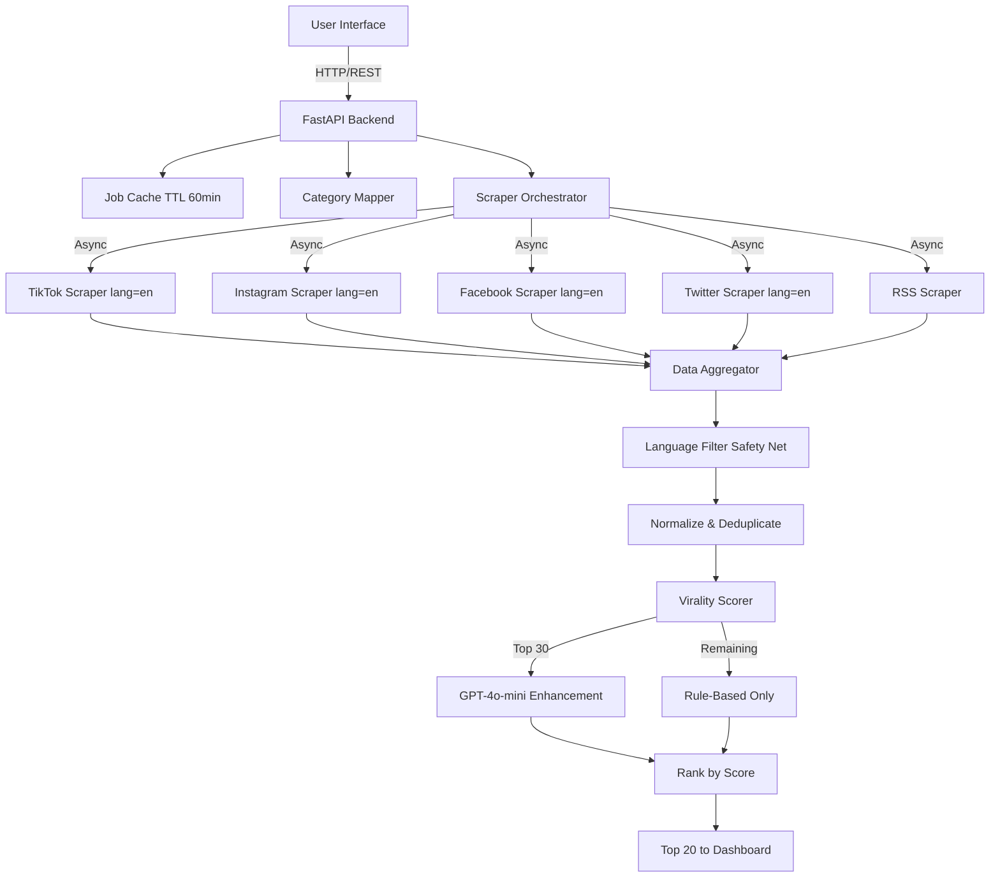

# 🐼 BoredPanda Content Sourcing Automation

> **Production-ready AI-powered viral story discovery system** that automates content sourcing across 5 social platforms with English-only filtering, hybrid virality scoring, and comprehensive writer guidance.

[](https://www.python.org/downloads/)
[](https://fastapi.tiangolo.com/)
[](LICENSE)
[]()

## 📋 Table of Contents

- [Overview](#-overview)
- [Features](#-features)
- [What's New](#-whats-new-latest-updates)
- [Architecture](#️-architecture)
- [Quick Start](#-quick-start)
- [Technical Stack](#-technical-stack)
- [API Documentation](#-api-documentation)
- [Deployment](#-deployment)
- [Cost Analysis](#-cost-analysis)
- [Troubleshooting](#-troubleshooting)
- [Project Structure](#-project-structure)

---

## 🎯 Overview

This system automates viral content discovery for BoredPanda's editorial team through:

1. **Multi-Platform Crawling**: Scrapes 5 platforms with English-only filtering
2. **Hybrid AI Scoring**: Rule-based metrics + GPT-4o-mini enhancement (0-100 scale)
3. **Intelligent Ranking**: Prioritizes high-virality potential stories
4. **Writer Guidance**: Actionable briefs with story angles and research tips

**Key Metrics**:
- ⚡ Processing Time: ~45-60 seconds per run
- 💰 Cost per Run: ~$0.05 (Apify + OpenAI)
- 📊 Output: Top 20 English stories with AI analysis
- 🌍 Platforms: TikTok, Instagram, Facebook, Twitter, RSS

---

## ✨ Features

### 🚀 Core Functionality

#### **Multi-Platform Scraping** (English-Only Content)
- 📱 **TikTok**: Hashtag scraping with `lang="en"` filter
- 📷 **Instagram**: Hashtag scraping with language preference
- 👥 **Facebook**: Keyword search with English filter
- 🐦 **Twitter**: Advanced search with `tweetLanguage="en"`
- 📰 **RSS Feeds**: Pre-selected English sources (Reddit, NYT, Vulture)

#### **Dual-Layer Language Filtering**
1. **Platform-Level**: Native API language parameters
2. **Post-Processing**: Heuristic detection filters non-English content
   - Detects CJK, Arabic, Cyrillic scripts
   - Checks for common English words
   - Filters if >20% non-Latin characters

#### **Hybrid Virality Scoring** (0-100 Scale)
**Rule-Based Metrics** (90 points total):
- Velocity (25 pts): Engagements/hour - measures momentum
- Volume (20 pts): Total engagement count - measures reach
- Engagement Rate (20 pts): Engagements/followers - measures resonance
- Diversity (15 pts): Cross-platform presence (planned)
- Novelty (10 pts): Content freshness vs historical data (planned)
- Authority (10 pts): Source credibility based on follower count

**LLM Enhancement** (+/-10 points):
- GPT-4o-mini analyzes top 30 posts
- Generates comprehensive 3-part editorial brief:
  1. **Virality Analysis**: Why it's trending (hooks, timing, relatability)
  2. **BoredPanda Fit**: Alignment with brand values
  3. **Writer's Roadmap**: 5 actionable tips (headlines, research, visuals)

#### **Category Intelligence**
Research-backed hashtag mappings for **10 categories**:
- Funny, Animals, Relationships, Art & Design
- Entertainment, Curiosities, Lifestyle, Society
- Entertainment News, Politics

Each category has platform-optimized hashtags/keywords.

### 🎨 Modern User Interface

**Input Form** (`index.html`):
- ✅ Multi-select category checkboxes (10 options)
- ✅ Multi-select source checkboxes (5 platforms)
- ✅ Date range slider (1-30 days back)
- ✅ Real-time validation
- ✅ Loading states with status updates

**Results Dashboard** (`dashboard.html`):
- 📊 Top 20 ranked story cards
- 🎨 Color-coded score badges:
  - 🟢 High (80-100): Strong viral potential
  - 🟡 Medium (50-79): Moderate potential
  - 🔴 Low (<50): Consider alternative angles
- 📈 Engagement metrics (likes, shares, comments)
- 📝 Expandable AI briefs with formatted guidance
- 🔗 Direct source links for verification
- 📱 Responsive design (mobile/tablet/desktop)

---

## 🆕 What's New: Latest Updates

### **v2.0 - Production-Ready Release** (December 2025)

#### 🔧 Critical Bug Fixes
1. **Dependency Compatibility** ✅
   - Fixed `apify-client` version (2.3.0 → 1.6.0)
   - Resolved `proxies` parameter error
   - Root cause: Breaking API changes in apify-client 2.x
   
2. **OpenAI Client Fix** ✅
   - Replaced `AsyncOpenAI` with synchronous `OpenAI`
   - Removed async/await from scoring methods
   - Improved reliability and error handling

3. **Twitter URL Mapping** ✅
   - Fixed incorrect field mapping (`url` → `tweetUrl`)
   - Twitter posts now link correctly to source tweets

4. **Dashboard HTML Syntax** ✅
   - Fixed malformed `<link>` tag preventing CSS load
   - Resolved "No stories found" display issue

#### 🌍 English Language Filtering
- **Platform Filters**: Added `lang="en"` to all scrapers
- **Safety Net**: Created `language_filter.py` utility
  - Heuristic English detection
  - Filters non-Latin scripts (>20% threshold)
 - Logs filtered content for monitoring
  
#### 📊 Enhanced Monitoring
- Detailed logging at each pipeline stage
- Language filtering statistics
- Performance metrics (processing time, API costs)

---

## 🏗️ Architecture

### System Design



### Data Flow

1. **Input** → Categories + Sources + Date Range
2. **Orchestration** → Parallel async scraping (5 platforms)
3. **Normalization** → Unified schema across platforms
4. **Language Filter** → English-only content
5. **Deduplication** → Remove URL duplicates
6. **Scoring** → Rule-based (all) + LLM (top 30)
7. **Ranking** → Sort by virality score
8. **Output** → Top 20 stories with briefs

**Processing Pipeline**:
```
45-60 seconds total
├─ Scraping: 20-30s (parallel)
├─ Normalization: 2-3s
├─ Language Filtering: 1-2s
├─ Scoring (Rule-based): 3-5s
└─ LLM Enhancement: 20-30s (30 API calls)
```

---

## 🚀 Quick Start

### Prerequisites

✅ **Python 3.9+** ([Download](https://www.python.org/downloads/))  
✅ **Apify API Token** ([Get Free Trial](https://apify.com/settings/integrations))  
✅ **OpenAI API Key** ([Get Key](https://platform.openai.com/api-keys))

### Installation

```bash
# 1. Clone repository
git clone https://github.com/yourusername/content_sourcing_automation.git
cd content_sourcing_automation

# 2. Create virtual environment
python -m venv venv

# Activate (Windows)
venv\Scripts\activate

# Activate (Mac/Linux)
source venv/bin/activate

# 3. Install dependencies (exact versions for compatibility)
pip install -r requirements.txt

# 4. Configure environment
copy .env.example .env
# Edit .env with your API keys
```

### Configuration

Create/edit `.env`:

```env
# Required
APIFY_API_TOKEN=apify_api_xxxxxxxxxxxxxxxxxxxxxxx
OPENAI_API_KEY=sk-proj-xxxxxxxxxxxxxxxxxxxxxxx

# Optional
ENVIRONMENT=development
PORT=8000
```

### Run Locally

```bash
# Start server
python -m backend.main

# Server runs at: http://localhost:8000
# API docs: http://localhost:8000/docs
```

### Verify Installation

```bash
# Test health endpoint
curl http://localhost:8000/health

# Expected response:
# {"status":"healthy","service":"BoredPanda Content Sourcing"}
```

---

## 🔧 Technical Stack

### Core Dependencies

```txt
# Backend
fastapi==0.104.1          # FastAPI framework
uvicorn[standard]==0.24.0 # ASGI server
python-dotenv==1.0.0      # Environment management

# APIs (VERSION CRITICAL)
apify-client==1.6.0       # ⚠️ Must be 1.x (2.x has breaking changes)
openai==1.3.5             # OpenAI GPT-4o-mini
aiohttp==3.9.1            # Async HTTP

# Data
pydantic==2.5.0           # Data validation
python-multipart==0.0.6   # Form data parsing
```

> **⚠️ WARNING**: `apify-client` version is critical. Do NOT upgrade to 2.x - it has breaking API changes incompatible with our initialization pattern.

### Frontend Stack

- **HTML5**: Semantic markup
- **CSS3**: Modern dark theme with gradients
- **Vanilla JavaScript**: No framework dependencies
- **SessionStorage**: Client-side state management

---

## 📖 API Documentation

### Interactive Docs

Once running, visit:
- **Swagger UI**: `http://localhost:8000/docs`
- **ReDoc**: `http://localhost:8000/redoc`

### Quick Reference

#### 1. Health Check
```http
GET /health
```
Returns: Service status + cache statistics

#### 2. Get Configuration
```http
GET /config
```
Returns: Available categories and sources

#### 3. Start Scraping
```http
POST /scrape
Content-Type: application/json

{
  "categories": ["Funny", "Animals"],
  "sources": ["TikTok", "Twitter"],
  "days_back": 7
}
```
Returns: `job_id` for polling

#### 4. Get Results
```http
GET /results/{job_id}
```
Poll every 2 seconds until `status: "completed"`

Returns:
```json
{
  "status": "completed",
  "total_found": 20,
  "top_stories": [
    {
      "platform": "Twitter",
      "url": "https://twitter.com/...",
      "text": "Post content...",
      "category": "Funny",
      "virality_score": 85.3,
      "ai_brief": "**Why It's Viral:**...",
      "likes": 12500,
      "shares": 850,
      "comments": 420,
      "author": "username",
      "timestamp": "2025-12-16T10:30:00Z"
    }
  ]
}
```

---

## 🚢 Deployment

### Option 1: Render.com (Recommended - Free Tier)

1. **Push to GitHub**
```bash
git init
git add .
git commit -m "Initial commit"
git remote add origin your-repo-url
git push -u origin main
```

2. **Deploy on Render**
   - Go to [render.com](https://render.com)
   - New → Web Service
   - Connect GitHub repo
   
3. **Configure Build**:
```yaml
Build Command: pip install -r requirements.txt
Start Command: uvicorn backend.main:app --host 0.0.0.0 --port $PORT
```

4. **Environment Variables**:
```
APIFY_API_TOKEN=your_token
OPENAI_API_KEY=your_key
ENVIRONMENT=production
```

**Live URL**: `https://your-app.onrender.com`

> **Note**: Free tier sleeps after 15min inactivity (~30s cold start)

---

### Option 2: Docker

Create `Dockerfile`:
```dockerfile
FROM python:3.11-slim

WORKDIR /app
COPY requirements.txt .
RUN pip install --no-cache-dir -r requirements.txt

COPY . .

CMD ["uvicorn", "backend.main:app", "--host", "0.0.0.0", "--port", "8000"]
```

Run:
```bash
docker build -t boredpanda-scraper .
docker run -p 8000:8000 \
  -e APIFY_API_TOKEN=your_token \
  -e OPENAI_API_KEY=your_key \
  boredpanda-scraper
```

---

## 💰 Cost Analysis

### Current Scale (Prototype)

**Per Run**:
- Apify: $0.02 (100 results across 5 platforms)
- OpenAI: $0.03 (30 GPT-4o-mini calls)
- **Total: ~$0.05/run**

**Monthly** (100 runs): **~$5**

### Apify Breakdown
```
TikTok:    20 results × $0.0001 = $0.002
Instagram: 20 results × $0.0001 = $0.002
Facebook:  20 results × $0.0001 = $0.002
Twitter:   20 results × $0.0001 = $0.002
RSS:       20 results × $0.0001 = $0.002
--------------------------------
Total:                    $0.020
```

### OpenAI Breakdown
```
Top 30 posts × GPT-4o-mini ($0.001/call) = $0.030
```

---

## 🔧 Troubleshooting

### Critical Issues

#### 1. `Client.__init__() got an unexpected keyword argument 'proxies'`

**Solution**: Ensure `apify-client==1.6.0` (NOT 2.x)
```bash
pip uninstall apify-client
pip install apify-client==1.6.0
```

**Root  Cause**: apify-client 2.x has breaking API changes

---

#### 2. Dashboard Shows "No stories found"

**Causes**:
 a) HTML syntax error (fixed in v2.0)
b) SessionStorage cleared
c) Job still processing

**Debug**:
```javascript
// In browser console:
sessionStorage.getItem('results')
// Should show JSON with stories
```

**Solution**: Hard refresh (Ctrl+Shift+R) and retry scrape

---

#### 3. Twitter URLs Not Working

**Solution**: Ensure Twitter scraper uses `tweetUrl` field
```python
# backend/utils/aggregator.py line 121
"url": item.get("tweetUrl", item.get("url", ""))
```

---

#### 4. Non-English Content Appearing

**Check**: Language filter is active
```python
# backend/orchestration/scraper_orchestrator.py
from backend.utils.language_filter import filter_english_posts
```

**Logs**: Should see "Filtered out N non-English posts"

---

### Common Installation Issues

**ModuleNotFoundError: backend**
```bash
# Always run from project root:
cd content_sourcing_automation
python -m backend.main
```

**Missing API Keys**
```bash
# Verify .env exists and has:
cat .env
# Should show APIFY_API_TOKEN and OPENAI_API_KEY
```

**Port Already in Use**
```bash
# Change port in .env:
PORT=8001

# Or kill process:
# Windows: netstat -ano | findstr :8000
# Mac/Linux: lsof -ti:8000 | xargs kill
```

---

## 📝 Project Structure

```
content_sourcing_automation/
├── backend/
│   ├── __init__.py
│   ├── main.py                      # FastAPI app + endpoints
│   ├── orchestration/
│   │   ├── __init__.py
│   │   └── scraper_orchestrator.py  # Parallel scraping coordinator
│   ├── scrapers/
│   │   ├── __init__.py
│   │   ├── tiktok_scraper.py        # TikTok API wrapper
│   │   ├── instagram_scraper.py     # Instagram API wrapper
│   │   ├── facebook_scraper.py      # Facebook API wrapper
│   │   ├── twitter_scraper.py       # Twitter API wrapper
│   │   └── rss_scraper.py           # RSS feed parser
│   ├── scoring/
│   │   ├── __init__.py
│   │   └── virality_scorer.py       # Hybrid scoring engine
│   └── utils/
│       ├── __init__.py
│       ├── category_mapper.py       # Category → hashtag mappings
│       ├── aggregator.py            # Data normalization + ranking
│       ├── cache.py                 # In-memory job storage (TTL)
│       └── language_filter.py       # 🆕 English detection utility
├── frontend/
│   ├── index.html                   # Input form UI
│   ├── dashboard.html               # Results display UI
│   ├── styles.css                   # Modern dark theme
│   ├── app.js                       # Form logic + API calls
│   └── dashboard.js                 # Results rendering
├── .env.example                     # Environment template
├── .gitignore                       # Git exclusions
├── requirements.txt                 # Python dependencies (EXACT VERSIONS)
├── README.md                        # This file
└── render.yaml                      # Render.com deployment config
```

---

## 🎯 KPIs & Success Metrics

### Editorial Efficiency (Primary)
- ⏱️ **Time Saved**: ~15 min per story discovered
- 🎯 **Target**: 30% of published stories from automation
- 📊 **Goal**: 10+ hours saved per week

### Content Quality (Secondary)
- 🎲 **Virality Accuracy**: Score correlation with actual performance
- 🎯 **Target**: 70%+ correlation (predicted vs published)
- 📈 **Measurement**: Track stories 7 days post-publish

### System Reliability (Operational)
- ✅ **Uptime**: 95%+ (measured monthly)
- ⚡ **Success Rate**: 95%+ completed jobs
- ⏱️ **Processing Time**: <60s (P95)

---

## 📈 Future Enhancements

### Phase 2 (Planned)
- [ ] Historical tracking (PostgreSQL)
- [ ] Duplicate detection across time
- [ ] Trending topic analysis
- [ ] Multi-language support (Spanish, Portuguese)
- [ ] Bulk export (CSV/JSON)
- [ ] Email alerts for high-score stories

### Phase 3 (Vision)
- [ ] Real-time monitoring dashboard
- [ ] Slack/Discord integration
- [ ] Custom scoring weights per editor
- [ ] A/B testing framework
- [ ] Performance analytics dashboard

---

## 🙏 Acknowledgments

- **Apify**: Robust scraping infrastructure
- **OpenAI**: GPT-4o-mini editorial analysis
- **BoredPanda**: Inspiring this automation project
- **Community**: Testing and feedback

---

## 📄 License

MIT License - see [LICENSE](LICENSE) file

---

## 📧 Support & Contact

**Issues**: [GitHub Issues](https://github.com/yourusername/content_sourcing_automation/issues)  
**Email**: your.email@example.com  
**Docs**: [Full Documentation](./docs/)

---

<div align="center">

**Built with ❤️ for BoredPanda's Editorial Team**

🐼 [BoredPanda.com](https://boredpanda.com) | 🚀 [Live Demo](#) | 📚 [API Docs](http://localhost:8000/docs)

</div>
